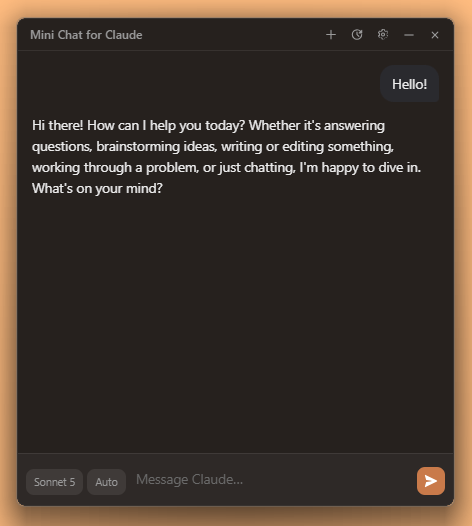
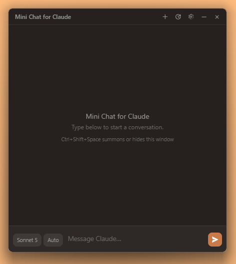
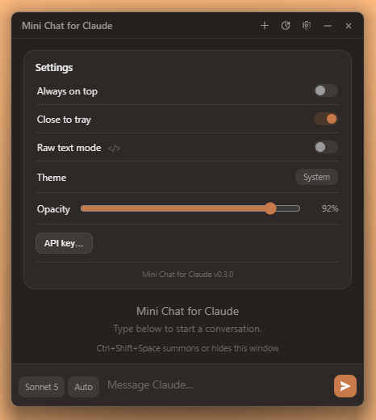

# Mini Chat for Claude

**A tiny floating chat widget for Claude that lives on your desktop.**

Frameless, always-on-top-toggleable, resizable, and beautifully responsive — inspired by Spotify's mini player. Summon it with a keybind, ask Claude anything, get streamed answers, get back to your task.

> ⚠️ **Unofficial.** This is an independent open-source project, not affiliated with or endorsed by Anthropic. *Claude* is a trademark of Anthropic, PBC. You bring your own [Anthropic API key](https://console.anthropic.com/) — your **conversations** go directly from your machine to Anthropic's API, nowhere else. The app also talks to two other endpoints on its own, neither carrying any chat content: `api.anthropic.com/v1/models` at startup, to keep the model picker current, and `github.com` on launch, to check for an app update.

<p align="center">
  
</p>

## Features

- **~2 MB installer, ~5 MB app** — Tauri, not Electron
- **`Ctrl+Shift+Space`** summons or dismisses it from anywhere
- **Streaming responses** with live markdown rendering (and a `</>` raw-text mode)
- **Model picker** — pulled live from your account via `/v1/models`, so it's never stale
- **Effort control** — low → max, per-model aware
- **Sessions** — every chat autosaves locally; browse, reload, delete
- **Export** — copy any chat as Markdown or save as `.md`
- **API key in the OS credential store** (Windows Credential Manager) — never plaintext on disk
- **Stop button** — halt a reply mid-stream (or press `Esc`). Closes the
  connection, so generation stops upstream and you stop paying for it. What
  arrived is kept.
- **Light and dark**, or follow your OS theme
- **Adjustable opacity**, so it can sit over your work without hiding it
- **Remembers its position and size**; pin it always-on-top from Settings
- **Auto-update alerts** from GitHub Releases (opt-in per update, one click)
- **No telemetry, no analytics, no account.** Three network calls, all listed
  above, and none of them is us

<table>
<tr>
<td width="50%"></td>
<td width="50%"></td>
</tr>
<tr>
<td align="center"><em>Summon it with a keystroke</em></td>
<td align="center"><em>Everything it does, on one card</em></td>
</tr>
</table>

## Install (Windows)

1. Grab the latest `Mini Chat for Claude_x.y.z_x64-setup.exe` from [Releases](../../releases)
2. SmartScreen may warn once (the app is unfortunately unsigned for now): **More info → Run anyway**
3. Launch, click the 🔑 button, paste your Anthropic API key — done

.. eventually: `winget install mini-chat-for-claude` *(coming soon)*

### Requirements

- Windows 10/11 (WebView2 ships with Windows 11; older Win10 will prompt to
  install it, which needs a connection during setup)
- An Anthropic API key with credits ([console.anthropic.com](https://console.anthropic.com/))

**On cost:** you pay Anthropic per message from your own API credits — a
Claude.ai subscription doesn't cover it. Short exchanges cost a fraction of a
cent; long ones cost more.

### Uninstalling

The uninstaller's **"delete application data"** checkbox removes both your saved
chats (plain JSON under `%APPDATA%`) and your API key from Windows Credential
Manager. Leave it unticked to keep them for a reinstall. A silent uninstall
(`/S`) always keeps them, since there's no dialog to tick.

## Build from source

```bash
# prereqs: Rust (stable) + Node 18+
npm install
npm run tauri dev      # development, hot-reload
npm run tauri build    # release installer → src-tauri/target/release/bundle/
```

See [CONTRIBUTING.md](./CONTRIBUTING.md) if you're planning to change something.

## Architecture

- **Tauri 2** — Rust backend, system WebView2, vanilla JS frontend (no framework)
- Streaming SSE client in Rust (`src-tauri/src/anthropic.rs`); tokens flow to the UI as Tauri events
- All platform-specific code is quarantined in `src-tauri/src/window.rs`
- Sessions are plain JSON files in the app data dir — yours to inspect, back up, or delete
- Responsive layout via CSS container queries — the window reflows to its own
  width, not the screen's, so it stays usable from 280px to 800px wide

## Security

Found a vulnerability? See [SECURITY.md](./SECURITY.md) for how to report it
privately. Don't open a public issue for anything that could put an
existing user's API key or machine at risk.

## License

[MIT](./LICENSE) © 2026 Brett Cherry. Third-party dependencies are listed in
[NOTICE.md](./NOTICE.md), with full per-crate license texts in
[`licenses/rust-third-party.html`](./licenses/rust-third-party.html).
